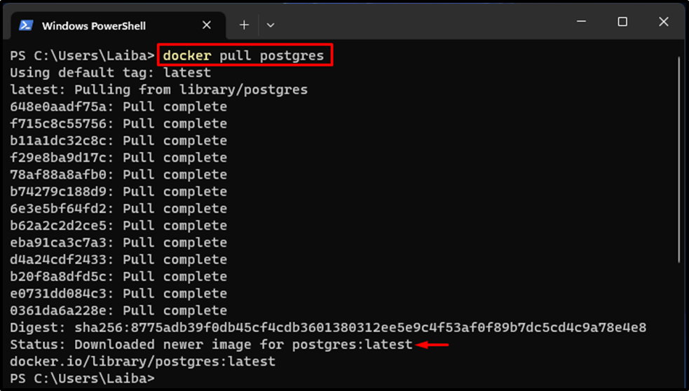
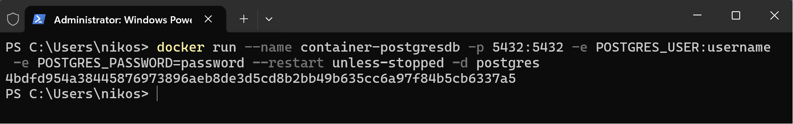
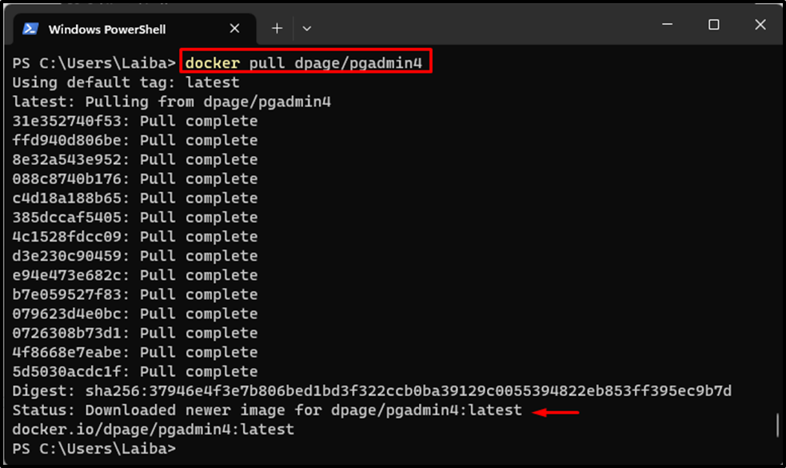
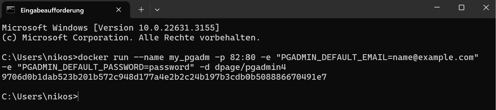
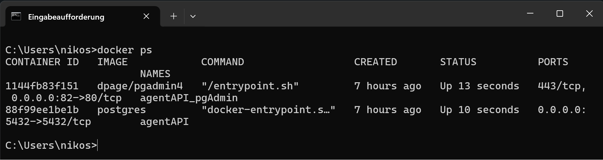
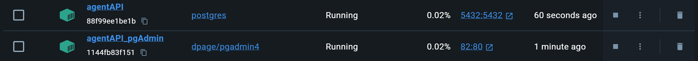

import Tabs from '@theme/Tabs';
import TabItem from '@theme/TabItem';

# PostgreSQL & pgAdmin mit Docker

:::info

- Installierten Sie Docker auf Ihrem System.
  :::
  Link: [Docker - Desktop](https://www.docker.com/products/docker-desktop/)

## Schritt 1: PostgreSQL-Image herunterladen

Öffnen Sie das Terminal und führen Sie den folgenden Befehl aus, um das offizielle Postgres-Image zu ziehen:

```bash
docker pull postgres
```

Link: [postgres - docker hub](https://hub.docker.com/_/postgres).



## Schritt 2: PostgreSQL-Container starten

Starten Sie einen Postgres-Container mit einem festgelegten Passwort für den `postgres`-Benutzer:

<Tabs groupId="run-code">
  <TabItem value="clear" label="Clear">

    ```bash
    docker run \
    --name <container-postgresdb> \
    -p 5432:5432 \
    -e POSTGRES_USER: <username> \ #default postgres
    -e POSTGRES_PASSWORD=<password> \
    --restart unless-stopped \ #optional
    -d postgres
    ```

  </TabItem>
  
  <TabItem value="copy" label="Copy">
    ```bash
    docker run --name container-postgresdb -p 5432:5432 -e POSTGRES_USER:username -e POSTGRES_PASSWORD=password --restart unless-stopped -d postgres
    ```
  </TabItem>
</Tabs>

Ersetze `<username>` (oder entferne flag), `<password>` und `<container-postgresdb>`.

<details>
  <summary>
    Erklärung
   </summary>

  <div>
- `--name <container-postgresdb>`: Gibt dem Container den Namen `<container-postgresdb>`.
- `-p 5432:5432`: Mappt den Port 5432 vom Host auf den Container.
- `-e POSTGRES_PASSWORD=<password>`: Setzt das Passwort für den eingetragenen User.
- `--restart unless-stopped`: Container wird neugestartet, außer er wird manuell gestoppt.
- `-d postgres`: Startet den Container im Hintergrund mit dem Docker-Image "postgres".



</div>
</details>

## Schritt 3: pgAdmin4-Image herunterladen

Laden Sie das pgAdmin4-Image herunter:

```bash
docker pull dpage/pgadmin4
```

Link: [pgAdmin - docker hub](https://hub.docker.com/r/dpage/pgadmin4).



## Schritt 4: pgAdmin4-Container starten

Erstellen und starten Sie einen pgAdmin4-Container:

<Tabs groupId="run-code">
  <TabItem value="clear" label="Clear">
    ```bash
    docker run \
    --name <container-pgadmin> \
    -p 82:80 \
    -e "PGADMIN_DEFAULT_EMAIL=<name@example.com>" \
    -e "PGADMIN_DEFAULT_PASSWORD=<password>" \
    -d dpage/pgadmin4
    ```
    </TabItem>

  <TabItem value="copy" label="Copy">
    ```bash
    docker run --name <container-pgadmin> -p 82:80 -e "PGADMIN_DEFAULT_EMAIL=<name@example.com>" -e "PGADMIN_DEFAULT_PASSWORD=<password>" -d dpage/pgadmin4
    ```
  </TabItem>
</Tabs>

Ersetze `<name@example.com>` mit Ihrer E-Mail-Adresse und `<passwort>` mit einem sicheren Passwort.

<details>
  <summary>
    Erklärung
   </summary>

  <div>
- `--name <container-pgadmin>`: Gibt dem Container den Namen `<container-pgadmin>`.

- `-p 82:80`: Mappt den Port 82 auf den Port 80 im Container. Dies bedeutet, dass Anfragen an Port 82 auf dem Host auf Port 80 im Container weitergeleitet werden.

- `-e PGADMIN_DEFAULT_EMAIL=<name@example.com>`: Setzt die Umgebungsvariable für die Standard-E-Mail-Adresse von PgAdmin auf "name@example.com".

- `-e PGADMIN_DEFAULT_PASSWORD=<password>`: Setzt die Umgebungsvariable für das Standardpasswort von PgAdmin auf .

- `-d dpage/pgadmin4`: Startet den Container im Hintergrund (detach mode) mit dem Image ["dpage/pgadmin4"](https://hub.docker.com/r/dpage/pgadmin4).



</div>
</details>

## Schritt 5: Laufende Docker-Container überprüfen

Überprüfen Sie, ob Ihre Container laufen:

```bash
docker ps
```


:::note
Docker Desktop

:::

## Schritt 6: pgAdmin im Browser aufrufen

Öffnen Sie Ihren Webbrowser und navigieren Sie zu:

```
http://localhost:82/
```

Melden Sie sich mit Ihrer E-Mail-Adresse und dem Passwort an, die Sie für pgAdmin festgelegt haben.

## Schritt 7: Verbindung zu PostgreSQL herstellen

In pgAdmin erstellen Sie eine neue Serververbindung:

name: container-postgresdb
host: host.docker.internal
database: postgres
user: postgres
password: admin
